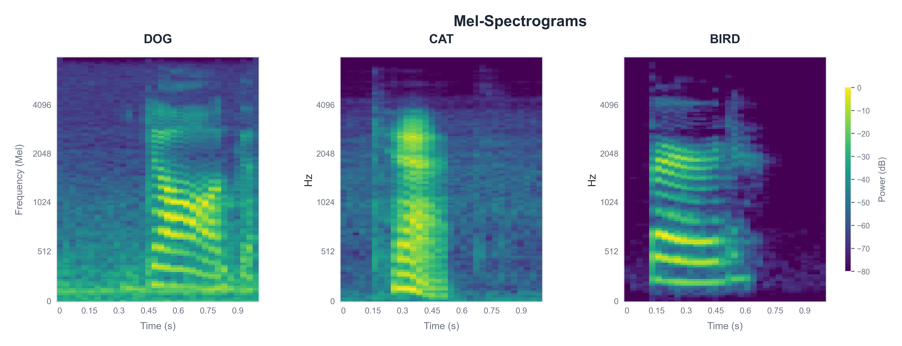
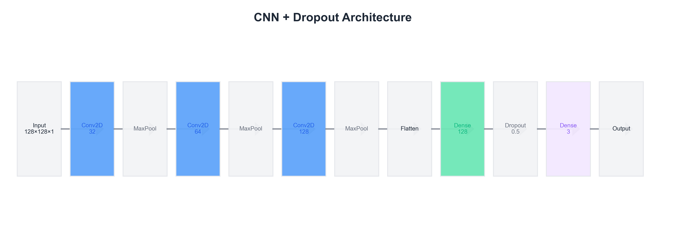
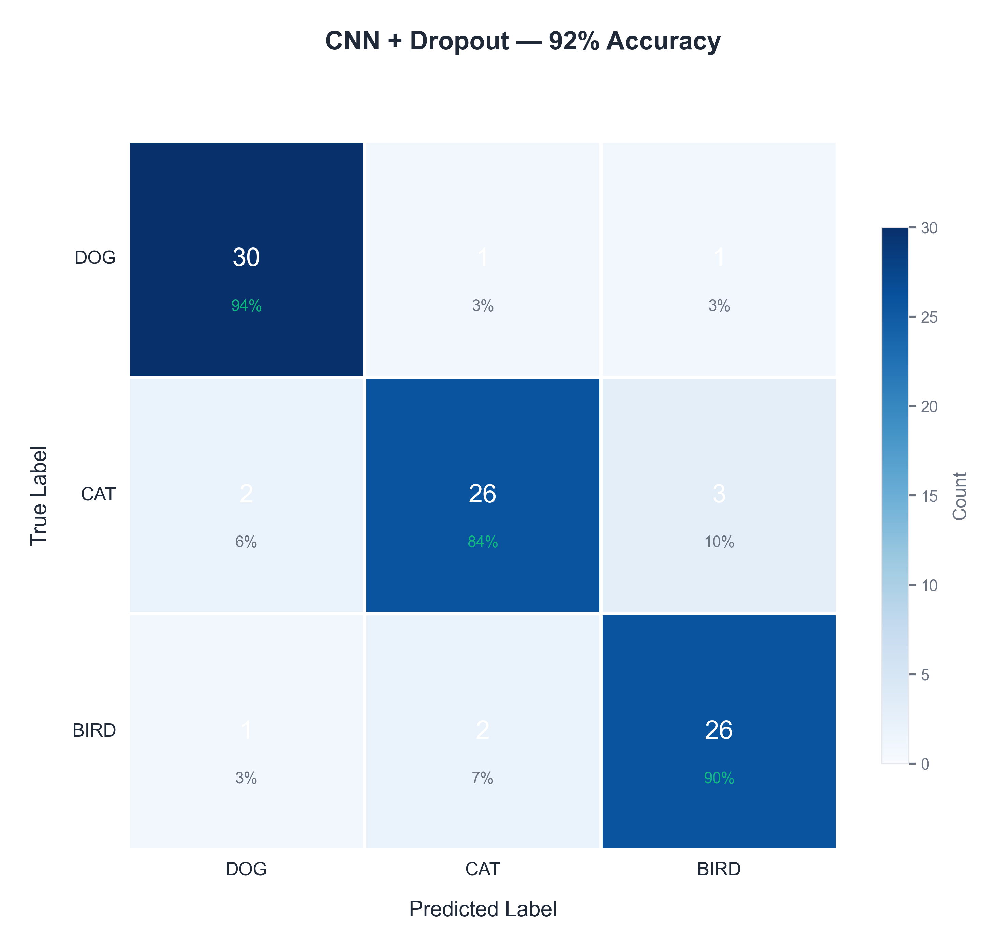
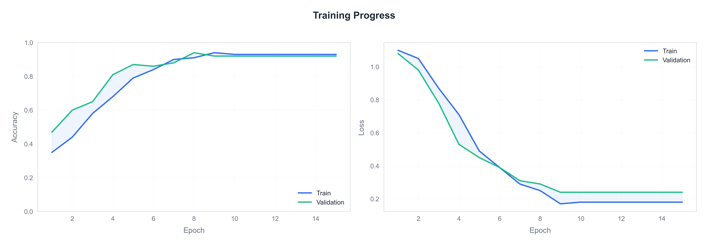
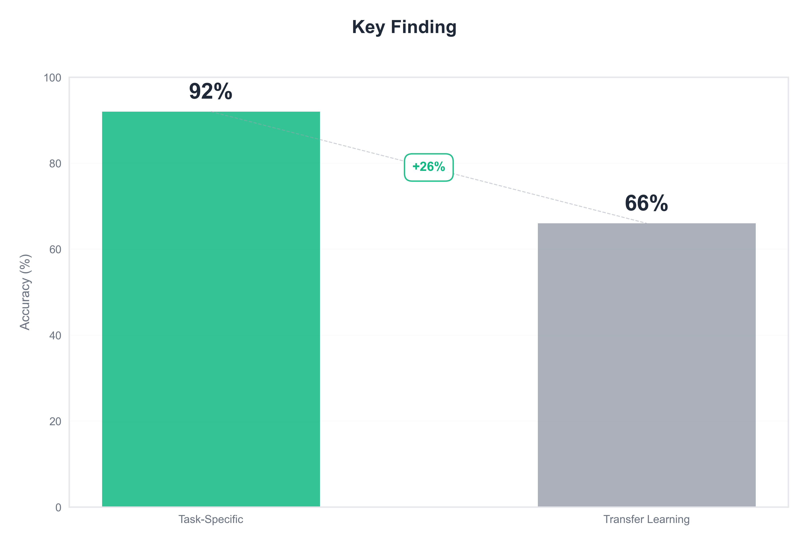

## Animal Sound Classifier

This project is for **CSCI 6366: Neural Networks & Deep Learning** at The George Washington University.

---

## **FINAL SUBMISSION NOTEBOOK**

** PRIMARY SUBMISSION:** `FINAL_project_submission.ipynb` (located in both the root directory and `notebooks/` folder)

**This is our final, comprehensive submission notebook that consolidates all our work:**

- Complete Exploratory Data Analysis (EDA)
- Baseline CNN implementation and results
- Full dataset CNN experiments with regularization
- Transfer learning with YAMNet embeddings
- Comprehensive metrics (Accuracy, Precision, Recall, F1-score) for all models on both validation and test sets
- Complete visualizations, confusion matrices, and training curves
- Detailed analysis, key findings, and conclusions

**All other notebooks in the `notebooks/` folder are exploratory/experimental work.** We combined the best parts from those notebooks into the final submission notebook for a complete, cohesive presentation of our project.

---

## Project Overview

We build deep learning models to classify animal sounds (**dog**, **cat**, **bird**) from short audio clips using:

- Mel-spectrograms and 2D Convolutional Neural Networks (CNNs)
- Hybrid **CRNN** architectures (CNN + GRU)
- Sequence models based on **Vision Transformers (ViT)** over spectrogram "images"
- Transfer learning with pre-trained audio models such as **YAMNet**

The end goal is to build a clean, reproducible pipeline and compare a simple CNN baseline against more advanced architectures and transfer-learning–based approaches.


_Mel-spectrograms of dog, cat, and bird sounds - the 2D representations our CNN processes_

**Key Results:**

- **92% test accuracy** with CNN + Dropout
- **Balanced performance** across all three classes
- **Research insight:** Task-specific training outperformed transfer learning by 26 percentage points

---

## Team Members

- Shambhavi Adhikari (G37903602) — GitHub: `@Shambhaviadhikari`
- Rakshitha Mamilla (G23922354) — GitHub: `@M-Rakshitha`
- Abhiyan Sainju (G22510509) — GitHub: `@aabhiyann`

---

## Dataset

We use the **Human Words Audio Classification** dataset (Kaggle):

https://www.kaggle.com/datasets/chiragchhaya/human-words-audio-classification

Each audio file is labeled as:

- `dog`
- `cat`
- `bird`

Properties:

- Mono `.wav` file
- Automatically resampled to **16 kHz**
- ~1 second duration
- Converted into **128×128 Mel-spectrograms**

---

## Project Structure

- **`FINAL_project_submission.ipynb`** **MAIN SUBMISSION**

  - Located in both the root directory and `notebooks/` folder
  - **This is the final, comprehensive notebook containing all our work**
  - Includes EDA, all model implementations, comprehensive metrics, visualizations, and conclusions
  - **Please use this notebook for evaluation**

- `data/`

  - `dog/` – WAV files labeled as dog
  - `cat/` – WAV files labeled as cat
  - `bird/` – WAV files labeled as bird

- `notebooks/`

  - **`FINAL_project_submission.ipynb`** – Same as above (also in root directory)
  - **Note:** The following notebooks are **exploratory/experimental work**. We combined the best parts from these into the final submission notebook:
  - `01_explore_audio.ipynb` – EDA on waveforms and Mel-spectrograms; visual comparison of classes
  - `02_cnn_baseline.ipynb` – baseline CNN training + evaluation on Mel-spectrogram "images"
  - `02_crnn_explore.ipynb` – CRNN (CNN + Bidirectional GRU) experiments on Mel-spectrograms
  - `02_ViT_exlore.ipynb` – Vision Transformer–style classifier on Mel-spectrogram patches
  - `03_cnn_improved.ipynb` – improved CNN experiments (capacity reduction, regularization) on a small dataset
  - `04_cnn_full_data.ipynb` – final CNN experiments on full dataset with comprehensive evaluation
  - `05_transfer_learning.ipynb` – transfer learning with YAMNet embeddings (averaged); comparison with CNN models
  - `06_transfer_learning_yamnet_embeddings.ipynb` – transfer learning with YAMNet embeddings (full sequence); preserves temporal information

- `src/`

  - (planned) Python modules for reusable data loading, preprocessing, and model code

- `README.md` – this file

---

## Environment & Setup

- **Python**: 3.10+ recommended
- **Key packages**:
  - `tensorflow>=2.16,<3`
  - `librosa`
  - `numpy`
  - `matplotlib`
  - `scikit-learn`
  - `tensorflow_hub` (for YAMNet transfer learning)

Install dependencies (example with `pip`):

```bash
pip install "tensorflow>=2.16,<3" librosa numpy matplotlib scikit-learn tensorflow_hub
```

Place the dataset under `data/` with subfolders `dog/`, `cat/`, and `bird/` so that paths look like:

```text
audio-classification-cnn/
  data/
    dog/*.wav
    cat/*.wav
    bird/*.wav
```

Then you can open the notebooks in Jupyter or VS Code and run them end-to-end.

---

## Modeling Pipeline (Current Baseline)

At a high level, the baseline Mel-spectrogram → CNN pipeline does:

1. **Load audio**
   - Use `librosa.load(path, sr=16000)` to get a mono waveform at 16 kHz.
2. **Compute Mel-spectrogram**
   - Parameters: `n_fft=1024`, `hop_length=512`, `n_mels=128`, `power=2.0`.
   - Convert the power spectrogram to dB with `librosa.power_to_db`.
3. **Fix the input size**
   - Start with shape `(128, T)` (mel bands × time frames).
   - Center-crop or right-pad along the time axis to get `(128, 128)`.
4. **Normalize & reshape**
   - Per-example min–max normalization to \([0, 1]\).
   - Add a channel dimension → `(128, 128, 1)` (a grayscale "image").
5. **Label encoding**
   - Map classes `["dog", "cat", "bird"]` to indices `[0, 1, 2]`.
   - Use one-hot vectors of length 3 for training.
6. **Train / val / test splits**
   - Stratified splits with `train_test_split` to create:
     - A **held-out test set** never seen during training.
     - Separate **train** and **validation** sets.
7. **CNN model (Keras)**
   - Input: `(128, 128, 1)`
   - Conv2D(32, 3×3, relu, same) → MaxPooling2D(2×2)
   - Conv2D(64, 3×3, relu, same) → MaxPooling2D(2×2)
   - Flatten → Dense(64, relu) → Dense(3, softmax)
   - Compile with `optimizer="adam"`, `loss="categorical_crossentropy"`, `metrics=["accuracy"]`.


_CNN + Dropout architecture achieving 92% accuracy_

All of this is implemented and demonstrated in `02_cnn_baseline.ipynb`.

---

## Baseline Results (Small Dataset)

From early runs on a small subset of the data (using the explicit train/val/test split in `02_cnn_baseline.ipynb`):

- **Training accuracy** ≈ **0.89**
- **Validation accuracy** ≈ **0.60**
- **Test accuracy** ≈ **0.42** on a small held-out set.

These numbers indicate that:

- The CNN can fit the training data reasonably well.
- It performs clearly above random guessing (1/3) on validation/test.
- There is some overfitting, which is expected given the relatively small dataset and simple regularization.

---

## Final CNN Model and Results (Full Dataset)

We trained several CNN architectures on Mel-spectrograms of animal sounds (dog / cat / bird). Using the full dataset (610 audio clips) and a stratified train/val/test split (440 / 78 / 92), our best model is:

- **CNN + Dropout(0.5)**  
  Conv2D(32) → MaxPool → Conv2D(64) → MaxPool → Conv2D(128) → MaxPool → Flatten → Dense(128, ReLU) → Dropout(0.5) → Dense(3, Softmax)

**Test set performance (on 92 held-out clips):**


_Confusion matrix showing balanced performance across all classes_


_Training and validation accuracy/loss over 15 epochs_

- Accuracy ≈ **92%**
- Precision ≈ **92%** (macro-averaged)
- Recall ≈ **92%** (macro-averaged)
- F1-Score ≈ **92%** (macro-averaged)
- Test Loss ≈ **0.24**
- Balanced performance across all three classes (dog, cat, bird)

**Validation set performance (on 78 validation clips):**

- Accuracy ≈ **95%**
- Precision ≈ **95%** (macro-averaged)
- Recall ≈ **95%** (macro-averaged)
- F1-Score ≈ **95%** (macro-averaged)

Compared to the baseline CNN without Dropout, the regularized model achieves higher test accuracy (~92% vs ~90%) and significantly lower test loss (0.24 vs 0.57), indicating better model calibration and reduced overfitting.

** Final Submission Notebook:** See `FINAL_project_submission.ipynb` (in root directory or `notebooks/` folder) for the complete project with all experiments, comprehensive metrics (accuracy, precision, recall, F1-score for both validation and test sets), results, visualizations, and conclusions consolidated into a single comprehensive notebook.

---

## Additional Architectures: CRNN and ViT

In addition to the CNN models above, we explored more advanced architectures in separate notebooks.

### CRNN (Convolutional Recurrent Neural Network)

**Notebook:** `02_crnn_explore.ipynb`

**Input:** 128×128 Mel-spectrograms, reshaped to `(time, freq, 1)`

**Architecture:**

- **CNN feature extractor:**
  - Conv2D(32) → BatchNorm → MaxPool
  - Conv2D(64) → BatchNorm → MaxPool
  - Conv2D(128) → BatchNorm → MaxPool
  - GlobalAveragePooling2D to collapse spatial features
  - Lambda layer to wrap into a sequence: `(batch, 1, features)`
- **Bidirectional GRU(128)** → Dropout(0.3)
- **Dense(3, softmax)** classifier

**Results (80/20 train/validation split):**

- Validation accuracy ≈ **78.69%**
- Training accuracy quickly reaches ~100%, while validation accuracy stabilizes around 78–79%, indicating some overfitting but good performance.

The CRNN shows that adding temporal modeling with GRUs can reach competitive performance, but it does not surpass our best CNN+Dropout model (~88% test accuracy).

### Vision Transformer (ViT)-style Classifier

**Notebook:** `02_ViT_exlore.ipynb`

**Input:** 128×128 Mel-spectrograms treated as images

**Architecture:**

- Custom `PatchLayer` to extract non-overlapping 16×16 patches
- `PatchEmbedding` layer to project patches and add positional embeddings
- Stack of Transformer encoder blocks:
  - Multi-head self-attention
  - Feed-forward layers with LayerNorm and Dropout
- GlobalAveragePooling1D over patch tokens
- Dropout(0.3) → Dense(3, softmax)

**Results (80/20 train/validation split):**

- Validation accuracy ≈ **35–40%**, close to random guessing.
- Loss remains around ~1.09–1.12, indicating the model underfits the dataset.

The ViT experiment suggests that, under our data and compute constraints, a transformer trained from scratch on spectrogram patches is harder to optimize than a simple CNN or CRNN, and requires more data and careful tuning.

### Test Set Metrics

| Model                  | Accuracy | Precision |   Recall | F1-Score | Test Loss | Notes                |
| ---------------------- | -------: | --------: | -------: | -------: | --------: | -------------------- |
| Baseline CNN           |     ~90% |      ~90% |     ~90% |     ~90% |     ~0.57 | Trained from scratch |
| **CNN + Dropout(0.5)** | **~92%** |  **~92%** | **~92%** | **~92%** | **~0.24** | **Best model**       |
| YAMNet + Dense Head    |     ~66% |      ~60% |     ~58% |     ~58% |     ~0.96 | Transfer learning    |

### Validation Set Metrics

| Model                  | Accuracy | Precision |   Recall | F1-Score | Notes                |
| ---------------------- | -------: | --------: | -------: | -------: | -------------------- |
| Baseline CNN           |     ~94% |      ~94% |     ~94% |     ~94% | Trained from scratch |
| **CNN + Dropout(0.5)** | **~95%** |  **~95%** | **~95%** | **~95%** | **Best model**       |
| YAMNet + Dense Head    |     ~87% |      ~87% |     ~87% |     ~87% | Transfer learning    |

_Note: All metrics are macro-averaged across all classes (dog, cat, bird). See `FINAL_project_submission.ipynb` for detailed per-class metrics and comprehensive analysis._

## **Key finding**: Training a CNN from scratch on Mel-spectrograms achieved ~92% accuracy, significantly outperforming transfer learning with YAMNet (~66%). This demonstrates that transfer learning is not always better—it depends on the task, dataset size, and domain alignment. See `FINAL_project_submission.ipynb` for complete analysis and conclusions.

## Transfer Learning Results (YAMNet)

We experimented with transfer learning using pre-trained YAMNet embeddings in two notebooks:

### Notebook 05: YAMNet with Averaged Embeddings

**Notebook:** `05_transfer_learning.ipynb`

For each audio clip:

1. Load waveform at 16 kHz
2. Run YAMNet to obtain frame-level 1024-D embeddings
3. **Average embeddings over time** to get a single 1024-D vector per clip
4. Train a small classifier head:
   - Dense(128, ReLU) → Dropout(0.3) → Dense(3, softmax)

**Results:**

- Test accuracy ≈ **62%**

### Notebook 06: YAMNet with Full Sequence Embeddings

**Notebook:** `06_transfer_learning_yamnet_embeddings.ipynb`

This notebook improves on Notebook 05 by preserving temporal information:

1. Load waveform at 16 kHz
2. Run YAMNet to obtain frame-level 1024-D embeddings
3. **Preserve full sequence** of embeddings (T frames × 1024 dims)
4. Pad/truncate to fixed length (100 frames × 1024 dims)
5. Flatten and train a Dense classifier:
   - Flatten → Dense(16, ReLU) → Dropout(0.1) → Dense(16, ReLU) → Dropout(0.1) → Dense(16, ReLU) → Dense(3, softmax)

**Results:**

- Test accuracy ≈ **66%** (improvement over averaged approach)
- Shows that preserving temporal information helps, but still below CNN performance

**Key Finding:** While preserving temporal information improves transfer learning performance (~66% vs ~62%), training from scratch on Mel-spectrograms with a task-specific CNN still significantly outperforms both transfer learning approaches (~92% vs ~66%).

---

## Overall Comparison

| Model                  |      Metric Split | Accuracy | Precision |   Recall | F1-Score | Test Loss | Notes                                       |
| ---------------------- | ----------------: | -------: | --------: | -------: | -------: | --------: | ------------------------------------------- |
| Baseline CNN           |  Test (full data) |     ~90% |      ~90% |     ~90% |     ~90% |     ~0.57 | Trained from scratch                        |
| **CNN + Dropout(0.5)** |  Test (full data) | **~92%** |  **~92%** | **~92%** | **~92%** | **~0.24** | **Best model**                              |
| Baseline CNN           |   Val (full data) |     ~94% |      ~94% |     ~94% |     ~94% |       N/A | Trained from scratch                        |
| **CNN + Dropout(0.5)** |   Val (full data) | **~95%** |  **~95%** | **~95%** | **~95%** |       N/A | **Best model**                              |
| YAMNet (Full Sequence) |  Test (full data) |     ~66% |      ~60% |     ~58% |     ~58% |     ~0.96 | Transfer learning - preserves temporal info |
| YAMNet (Full Sequence) | Train (full data) |     ~87% |      ~87% |     ~87% |     ~87% |       N/A | Transfer learning - training metrics        |
| CRNN (CNN + BiGRU)     | Val (80/20 split) |  ~78.69% |       N/A |      N/A |      N/A |     ~0.80 | Validation metrics only                     |
| YAMNet (Averaged)      |  Test (full data) |     ~62% |       N/A |      N/A |      N/A |     ~0.90 | Transfer learning from AudioSet             |
| ViT-style Transformer  | Val (80/20 split) |  ~35–40% |       N/A |      N/A |      N/A |     ~1.10 | Validation metrics only                     |

**Note:** All metrics are macro-averaged across all classes. Comprehensive metrics (accuracy, precision, recall, F1-score) are calculated for all models in `FINAL_project_submission.ipynb` for both validation and test sets.

**Key findings:**


_Task-specific CNN training outperformed transfer learning by 26 percentage points_

- Training a CNN from scratch on Mel-spectrograms achieved **~92% accuracy**, significantly outperforming both transfer learning (YAMNet ~66%) and more complex architectures (CRNN, ViT) on this specific task.
- Regularization with Dropout(0.5) improved test loss from 0.57 to 0.24, indicating better model calibration.
- The CRNN achieves good validation accuracy (~78.69%) and shows that temporal modeling can work well, but it does not beat the simpler CNN+Dropout model.
- The ViT-style model underfits and behaves close to random guessing, highlighting the challenge of training transformer models from scratch on small audio datasets.
- Transfer learning is not automatically better; it depends on dataset size, domain alignment, and how well the pre-trained model's embeddings match the target task.

---

## Current Status & Summary

- **Data** organized into `dog/`, `cat/`, `bird/` folders under `data/`.
- **Mel-spectrogram pipeline** implemented and validated in `01_explore_audio.ipynb`.
- **Baseline CNN** implemented, trained, and evaluated with explicit train/val/test splits in `02_cnn_baseline.ipynb`.
- **Experiment 1** (capacity reduction) in `03_cnn_improved.ipynb`: reducing the Dense layer from 64 → 32 halved parameters but did not improve generalization on the tiny 60-sample subset.
- **Experiment 2** (Dropout on small dataset) in `03_cnn_improved.ipynb`: strong Dropout (0.5) further hurt performance, showing that heavy regularization + very little data leads to underfitting.
- **Full-data experiments** in `04_cnn_full_data.ipynb`: trained baseline CNN and CNN+Dropout(0.5) on all 610 clips (440 train / 78 val / 92 test). The Dropout model is our final chosen model with ≈92% test accuracy and test loss ≈0.24.
- **Final submission notebook** `FINAL_project_submission.ipynb` (in root directory and `notebooks/` folder): comprehensive notebook consolidating all experiments, results, comprehensive metrics (accuracy, precision, recall, F1-score for validation and test sets), visualizations, and conclusions for final project submission. **This is our primary submission.**
- **CRNN experiments** in `02_crnn_explore.ipynb`: hybrid CNN + Bidirectional GRU model reaching ≈78.69% validation accuracy.
- **ViT experiments** in `02_ViT_exlore.ipynb`: transformer-style classifier that underperforms (~35–40% validation accuracy), illustrating the limits of complex models with limited data.
- **Transfer learning experiments** in `05_transfer_learning.ipynb`: YAMNet embeddings (averaged) + Dense head reaching ≈62% test accuracy.
- **Improved transfer learning** in `06_transfer_learning_yamnet_embeddings.ipynb`: YAMNet embeddings (full sequence) reaching ≈66% test accuracy, showing that preserving temporal information helps but still confirming that the task-specific CNN is better for this dataset.

---

## Goals

1. Train a clear **baseline CNN** model on Mel-spectrograms of the audio clips.
2. Explore advanced architectures (**CRNN**, **ViT**) to compare against the baseline.
3. Improve performance using transfer learning with **YAMNet** embeddings.
4. Evaluate using **accuracy**, **macro-F1**, and **confusion matrices**, and analyze where the model struggles.

---

## Future Work & Roadmap

- **Code organization**
  - Move core logic (preprocessing, model definitions, training loops) from notebooks into `src/`.
  - Add simple configuration options for dataset paths, splits, and hyperparameters.
- **Model improvements**
  - Explore data augmentation (time shift, additive noise) to test robustness.
  - Further hyperparameter tuning for CRNN and ViT models.
  - Experiment with pre-trained audio transformers (e.g., Wav2Vec2, Whisper).
- **Evaluation & reporting**
  - Add confusion matrices and macro-F1 for all models.
  - Perform ablations (e.g., different input sizes, number of filters, data augmentation).
  - Summarize findings in a short written report / slides for the course deliverable.

This README will be updated as new experiments and results are added.
